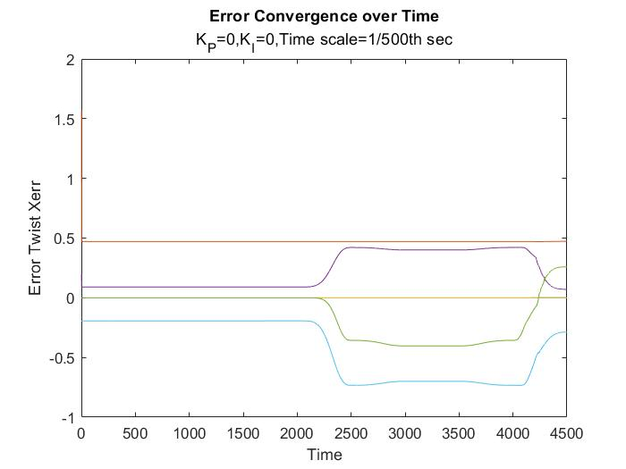
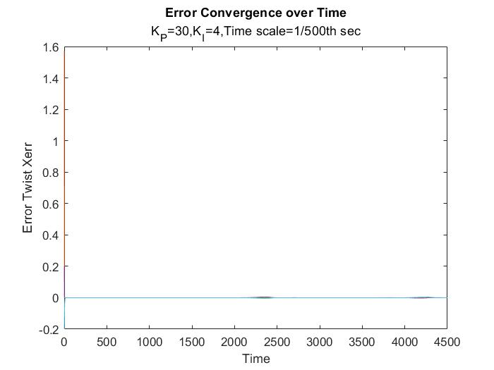
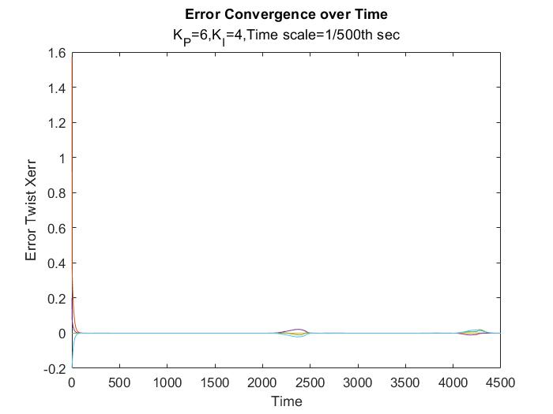

# KUKA-youBOT-Motion-and-Control
In this project, a control algorithm is constructed to plan a trajectory, simulate the control action of youBot (a mobile base with four meconium wheels and a 5R robot arm), to complete a task that youBot pick up a cube at an initial location, move and place the cube at the desired position using coppeliaSim simulation package.

## Submodules

- Trajectory Generator: Trajectory, the specification of robot position as a function of time, is computed given the intial and final transformation matrices. Using the transformation matrix for each of these 8 trajectory segments and ScrewTrajectory function from the Modern Robotics package, we generate a list of configurations of the gripper at each timestep using quintic time scaling.

- Next State: In this submodule, we estimate the chassis configurations from the sensor data. We assume that each wheel of an omnidirectional robot, and each rear wheel of a drive or car, has an encoder that senses how far the wheel has rotated in its driving direction.

- Feedback Control: In this module, we compute the control action to minimize error given the initial and final states. A feedforward controller is also implemented along with feedback to intitate motion before any error accumulates over time!

- main: This submodule combines the previously explained submodules to move and control the motion of KUKA youBOT.

## Results

- ### Please check /Videos for visualization of KUKA youBOT in the Coppelia Sim.
